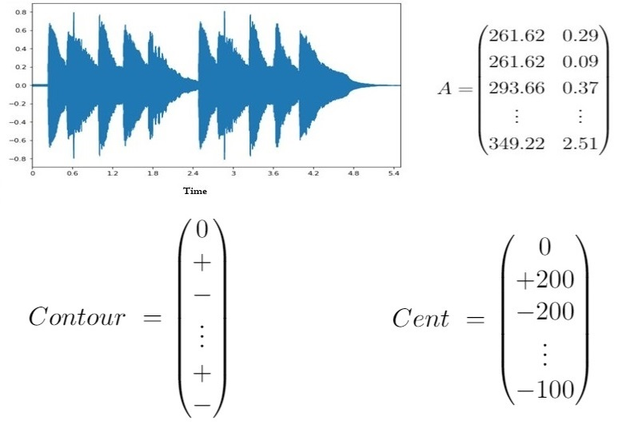
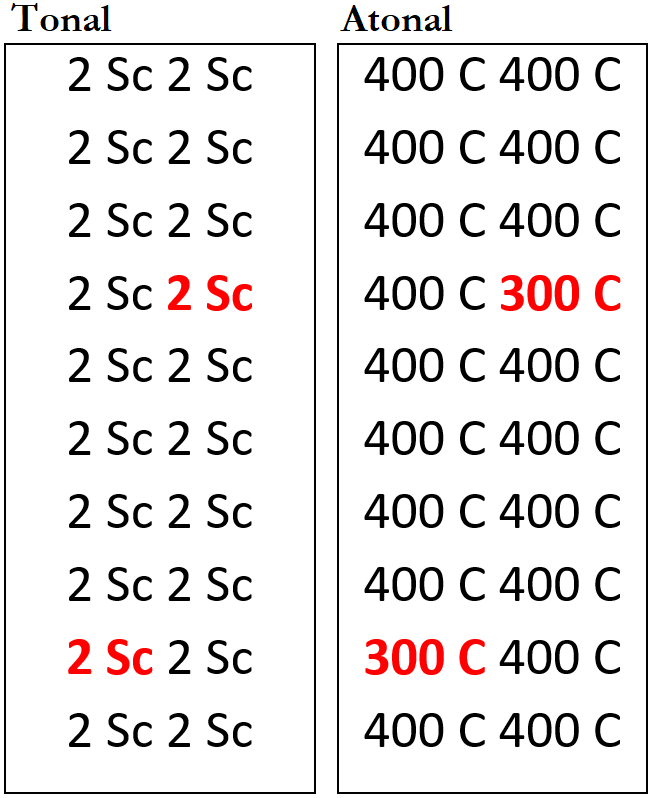

 

# SCALE STEPS AND CENTS
## Acoustic and abstract factors involved in intervallic perception

Pedro A. S. O. Neto

### Orientadora 
Patrícia M. Vanzella

<!--
_footer: 'Defesa de mestrado - Centro de Matemática, Computação e Cognição'
-->

---

# Roteiro da apresentação

- Definição de abstração
- Relevância do conceito de abstração
- Apresentação da proposta de pesquisa
- Apresentação dos experimentos/resultados
- Discussão e conclusão

---

# Abstração
 

<!--
_footer: Fonte: https://computersciencewiki.org/
-->

---

# Abstração
 

<!--
_footer: Fonte: https://computersciencewiki.org/
-->

---

# Abstração

---

# Música, abstração e ciência cognitiva

---

# Música, abstração e ciência cognitiva
 

---

# Graus de escala ou cents?
 

<!--
_footer: Música, abstração e ciência cognitiva
-->

---

# Perguntas de pesquisa

- Graus de escala têm relevância perceptual?
- Em contexto tonal, intervalos são percebidos em função de cents ou de graus de escala?

---

# Hipóteses (tonal)

 

<!--
_footer: Experimento 1: Hipótese 1
-->

---

# Hipóteses (atonal)

 

<!--
_footer: Experimento 1: Hipótese 2
-->

---

# Experimento 1

- Design (ME, RM)
- Participantes (N = 60)
- Procedimentos 

 

---

# Estímulos

 
Primers tonais e atonais

 

<!--
_footer: Experimento 1: Estímulos
-->

---

## RESULTADOS

 

<!--
_footer: Experimento 1: Resultados
-->
---

---
# Experimento 2

- Design (oddball, RM)
- Participantes (N = 368)

 

---

# Estímulos

 
Blocos 1 e 2

 

<!--
_footer: Experimento 2: Estímulos
-->
---

---

# Hipóteses

- Intervalos percebidos em função de grau de escalas
- Diferença de cent mais saliente na condição atonal

 

---

## RESULTADOS

 

<!--
_footer: Experimento 2: Resultados
-->
---

---

# Discussão e conclusões

- ### **Graus de escala como descritores de intervalo**
- Abstrações acústicas vs abstrações musicais
- Aplicações

---

# Discussão e conclusões

- Graus de escala como descritores de intervalo
- ### **Abstrações acústicas vs abstrações musicais**
- Aplicações

---

# Discussão e conclusões

- Graus de escala como descritores de intervalo
- Abstrações acústicas vs abstrações musicais
- ### **Aplicações**

---

# Agradecimentos

